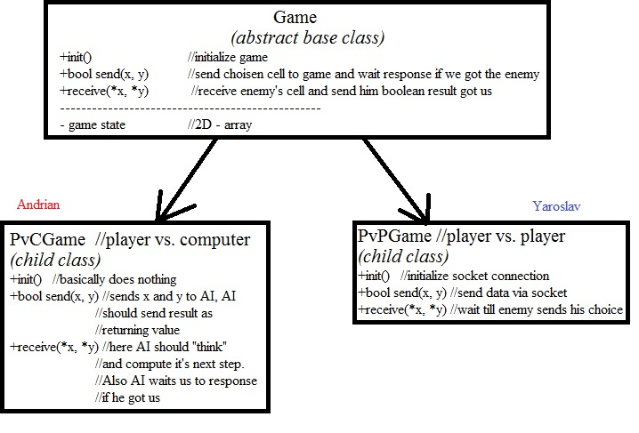
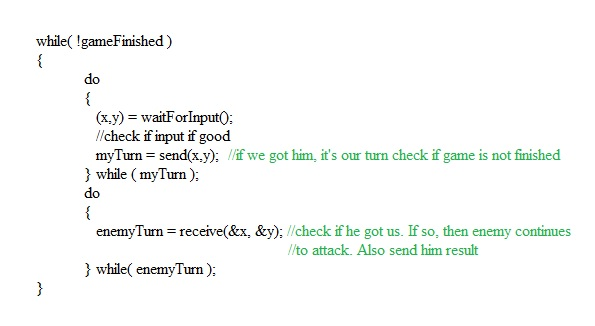

# Laboratory  work on Windows Programming #5
###### st. gr. FAF-111: Ciupin Iaroslav, Cojanu Irina, Boscanean Andrian, Ciugureanu Alexandru

## Project Name: Space War

### Introduction
This program was developed collaborating together. It is a space style clone of Sea Battle Fight. Each of us was working on his part of project:
	
* Ciupin Iaroslav - General scheme(carcass) of project. Managing task between us. Network part of application.
* Cojanu Irina - GUI design and implementation. 
* Boscanean Andrian - Artificial Intelligence for computer. Random arrangement  of ships algorithm.
* Ciugureanu Alexandru - Textures for space battleships

### About the Game
Game has 2 modes: offline(vs. Computer) and online(vs. Another Player). Initially you have 10 ships which have sum of cells 20. There are placed in random parts of the map according so specific algorithm. If you want another placement you can shuffle ships. When you are happy with ships configuration, go to main menu Game->vs. Computer or Game->vs. Player. When playing with another player you have 2 possibilities: create a game and wait for a connection from another player or you connect to already created game. For connection you need IP address of server. Network mode is based on Windows Sockets. All the connections that need some time to pass are placed in separate thread.

### About AI Brain Algorithm
It tried to think like a simple man, without a special strategy,but at least careful. He thinks in the following way:
* if there is no injured ship he picks randomly a free,never chosen position
* if he have some luck and  injures once a ship,he pick randomly a position around that coordinate, until he guesses
* if AI gets 2 or more shoots on a ship,then misses in a line ,he shoots in opposite direction and kills that ship
* if AI kills a ship, it returns to beginning until kills the remaining ships
whithout regrets.

### Some initial sketches
These abstract sketches were designed by Ciupin Iaroslav. Lately they were a bit changed when we encountered different problems.

### Screen shot of final version

